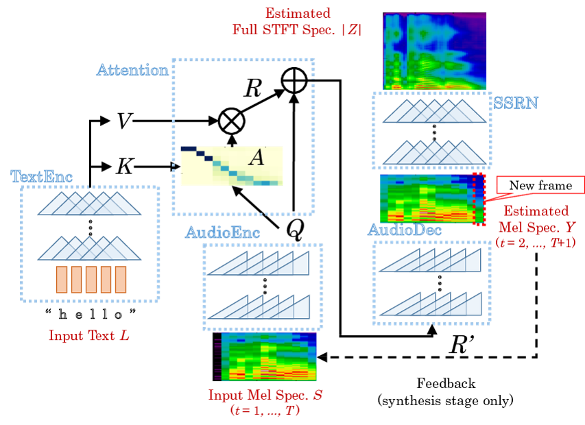

This bangla text to speech model is a CNN based architecture with Attention mechanism.    
Methodology based on : [Efficiently Trainable Text-to-Speech System Based on Deep Convolutional Networks with Guided Attention](https://arxiv.org/abs/1710.08969)  
Implementation based on: [pytorch-dc-tts](https://github.com/tugstugi/pytorch-dc-tts) 

Bengali Text to Speech Dataset: [Bangla tts dataset by google](https://research.google/tools/datasets/bengali-tts/) 
 contains approximately 3100 bangla sentences. This dataset was collected from native Indian Bengali and Bangladesh Bengali
speakers. 

### Result
As there was hardware limitation, the training for the coarse mel spectrogram to the full STFT spectrogram was done only for 60 iterations. The audio samples and pretrained models can be found here [link](https://drive.google.com/drive/folders/1SVvGq1D5v6CJ9Uk0mEFSz--Y8eT3yoGK?usp=sharing) 

### About The Model Architecture
This TTS model consists of two networks: (1) Text2Mel, which synthesize a mel spectrogram from an input text, and (2) Spectrogram Super-resolution Network (SSRN), which convert a coarse mel spectrogram to the full STFT(Short-time Fourier transform) spectrogram. Figure below shows the overall architecture of the model. For more read [this](https://arxiv.org/abs/1710.08969)  

    

### Training Process
1. Download the dataset into /datasets folder
2. Preprocess the dataset.
2. Train the Text2Mel model
3. Train the SSRN model`
4. Test the model
 
Colab Notebook : (https://colab.research.google.com/drive/1AjsxzBu6ekcv0GF3dyWubj04hhwwHkjE?usp=sharing) This colab playground might seems to be a total mess.

